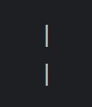

# DigitalNumbers

This small program receives the numbers entered by the user and displays these numbers in digital format on the console. 
It looks like digital time on an old electronic clock.

For example, the number 1 will be displayed as

  
and the number 2 is like

etc.

If the user enters a separator, such as a dot or a comma, the program displays an underscore instead of _. 
User can enter as many delimiters as he likes.

Enjoy! ;)
